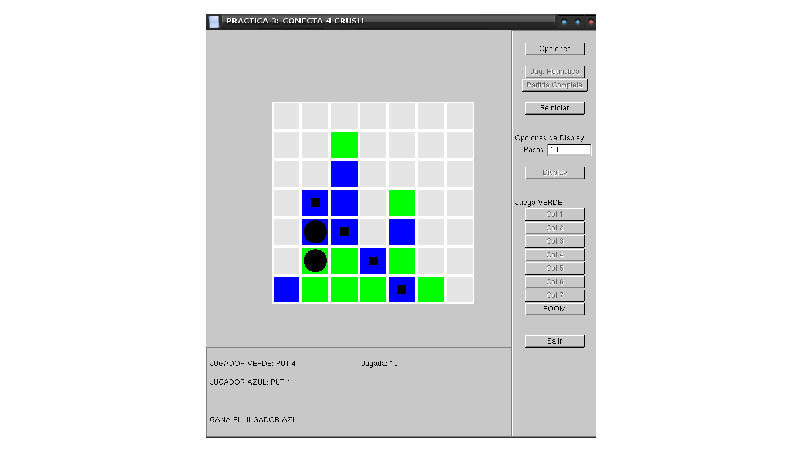

Conecta4-Crush
========================
Práctica sobre agentes deliberativos de Inteligencia Artificial(IA)  

Uso
------------------------
Descomprimir `4RayaCrush_windows.zip` si trabajas con Windows o `4rayaCrush_linux.tgz`
si lo haces con Linux.  
Mover los archivos `player.cpp` y `player.h` al directorio generado al descomprimir y
compilar con `make` desde él.  
Después, ejecutar `4rayaCrush` y a jugar :wink:.

Licencia
------------------------
El proyecto en conjunto se distribuye bajo la licencia [GPL](LICENSE).  

La licencia no se aplicará sobre el material aportado por el profesor.
